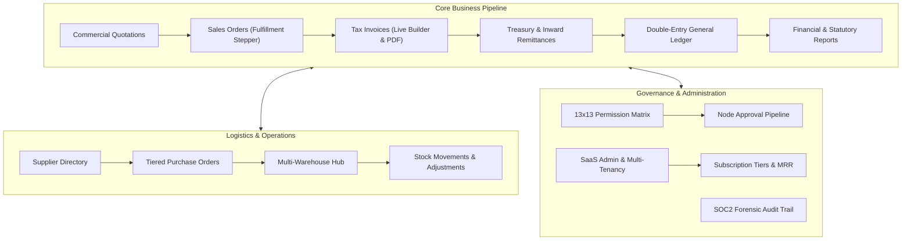

# Enterprise Billing & ERP SaaS Platform

[](https://react.dev/)
[](https://www.typescriptlang.org/)
[](https://vitejs.dev/)
[](https://unocss.dev/)
[](LICENSE)

A **professional, modern, commercial-grade Multi-Tenant Billing & Complete ERP SaaS Platform** architected for enterprises in **Sri Lanka and international markets** (Asia, Middle East, Europe, and Global).

Designed to replace disconnected software stacks, this platform seamlessly unifies billing, multi-currency trade, multi-warehouse logistics, double-entry financial accounting, customer credit management, tiered procurement approvals, and SaaS multi-tenancy.

---

## 🌟 Key Highlights & Differentiators

- **Sri Lanka IRD Statutory Tax Compliance**: Native computation and itemization of standard **18.0% Value Added Tax (VAT)**, **2.5% Social Security Contribution Levy (SSCL)**, and **Simplified VAT (SVAT)** credit schedules.
- **Global Multi-Currency & Multi-Branch**: Real-time conversions between **LKR**, **USD**, **EUR**, **GBP**, **AED**, and **SGD** across multiple domestic and offshore operating branches (Colombo HQ, Kandy Distribution, Dubai Freezone, Singapore Logistics).
- **Zero CSS File Footprint**: Complies strictly with zero `.css` source files by utilizing **UnoCSS** virtual compilation for full utility-first styling and high-performance DOM delivery.
- **Enterprise 13x13 RBAC Matrix**: 13 enterprise role personas with granular toggles across 13 permission categories (*View, Create, Edit, Delete, Approve, Finalize, Cancel, Export, Print, Refund, Adjust, Post, Reverse*).
- **Financial Invariant Protection**: Finalized financial records are immutable. Adjustments enforce strict enterprise accounting rules through **Credit Notes**, **Debit Notes**, and **Audited Journal Vouchers**.

---

## 🏗️ Platform Modules



### 1. Executive Financial Dashboard
- **6 Real-time KPI Cards**: Gross Revenue (`LKR 101.64M`, `+18.4%`), Outstanding Receivables (`LKR 6.22M`), Monthly Sales (`LKR 25.8M`, `+22.1%`), Operating Expenses, Net Profit (`LKR 36.67M`, margin `36.1%`), and Warehouse Stock Valuation (`LKR 112.5M`).
- **Interactive SVG Vector Charts**: Revenue & Profit Performance (Area/Line comparison), Revenue by Category (Donut chart), and Receivables Aging breakdown (Segmented risk progress).
- **Quick Operations Hub**: Rapid shortcuts for billing, quotations, payments, customer creation, stock adjustments, and reports.
- **Live Audit Stream**: Real-time activity timeline with user avatars, roles, timestamps, and execution statuses.

### 2. Sales, CRM & Billing Workspace
- **Customer CRM**: Corporate credit facilities, payment terms (Net 15/30/45/60), outstanding balances, customer avatars, and detailed profile modal with customer statements.
- **Product Catalog**: SKU registry, barcode indexing, category filters, cost/selling price margins, stock indicators (low stock warnings), and grid/table view modes.
- **Commercial Quotations**: Itemized proposal builder with live line calculations, status transitions (*Draft &rarr; Sent &rarr; Approved*), and one-click conversion to Sales Orders or Tax Invoices.
- **Sales Orders Fulfillment**: Visual progress stepper (*Draft &rarr; Confirmed &rarr; Processing &rarr; Delivered &rarr; Completed*) and direct conversion to invoice.
- **Split-Screen Invoice Builder**: Left-side line item configuration with discounts and taxes; right-side live real-time calculation card.
- **Printable Tax Invoice Preview**: Realistic printable paper layout with company branding, TIN (`VAT-109283741-7000`), SVAT (`SVAT-002941`), customer bill-to/ship-to, cryptographic QR verification code, CEFT/SWIFT payment advice, and Credit Note issuance.

### 3. Treasury & Payments
- **KPI Metrics**: Total Collected, Pending Collections, Overdue Accounts, and Reversals.
- **Multi-Channel Settlements**: Bank Transfer (CEFT / SLIPS / SWIFT), Online Gateway (PayHere LK / Stripe), Corporate Card POS, Cheque, and Cash.
- **Automated Double-Entry Posting**: Receipts automatically generate balanced Journal Vouchers (*Debit: Bank 1020, Credit: Accounts Receivable 1200*) and update customer credit facilities.

### 4. Inventory & Multi-Warehouse Logistics
- **Multi-Facility Tracking**: Occupancy gauges for Colombo Central Logistics Hub, Kandy Industrial Park, Dubai Silicon Oasis Depot, and Tuas Automated Hub (Singapore).
- **Stock Movement Ledger**: Complete audit trail of inbound purchases, outbound sales, and transfer vouchers.
- **Stock Adjustment Dialog**: Commit stock adjustments with required audit justifications.

### 5. Procurement & Vendor Relations
- **Supplier Directory**: Vendor management with country tags, ratings, tax IDs, and trade payables.
- **Tiered Purchase Orders**: Multi-level authorization workflow (*Pending Manager &rarr; Pending Finance &rarr; Approved*).

### 6. General Ledger & Financial Reports
- **5-Tier Chart of Accounts**: Assets (1000s), Liabilities (2000s), Equity (3000s), Revenue (4000s), Expenses (5000s).
- **General Journal Vouchers**: Manual and automated balanced debit/credit voucher entries.
- **14 Financial & Tax Reports**: Includes Profit & Loss (P&L), Balance Sheet, Cash Flow, Adjusted Trial Balance, and Sri Lanka IRD Statutory Tax Returns (VAT & SSCL) with Excel and print exports.

### 7. Governance, Security & SaaS Admin
- **13-Role Granular RBAC**: Platform Super Admin, Tenant Owner, Administrator, Finance Manager, Accountant, Sales Manager, Sales Executive, Purchase Manager, Inventory Manager, Warehouse Staff, Cashier, Auditor, and Employee.
- **Visual Approval Workflows**: Tiered monetary thresholds requiring sequential authorized signatures.
- **Forensic Audit Log**: Immutable record of actions with origin IP, user role, and Before/After state comparison diff viewer.
- **SaaS Platform Super-Admin**: Tenant management, MRR/ARR analytics, storage telemetry, and subscription packaging (*Starter, Professional, Business, Enterprise*).

---

## 🛠️ Technology Stack

| Layer | Technology |
| :--- | :--- |
| **Frontend Framework** | React 19 + TypeScript |
| **Build Tool & Bundler** | Vite 6 |
| **Styling & Design System** | UnoCSS (Tailwind-compatible utility presets, zero physical `.css` files) |
| **Icons & Visuals** | Lucide React + Custom Responsive SVG Financial Vector Graphics |
| **Interactions & Effects** | Canvas Confetti (Celebratory Onboarding & Payment milestones) |
| **Testing** | Node.js Test Runner (`node --test`) for unit and regression testing |

---

## 🚀 Getting Started

### Prerequisites
- **Node.js**: v20.0.0 or higher (v24 LTS recommended)
- **npm**: v10.0.0 or higher

### Installation
```bash
# Clone the repository
git clone https://github.com/piraveena26/ENTERPRISE-BILLING-ERP-SaaS-PLATFORM.git
cd ENTERPRISE-BILLING-ERP-SaaS-PLATFORM

# Install dependencies
npm install
```

### Running the Development Server
```bash
npm run dev
```
Open [http://localhost:5173](http://localhost:5173) in your browser.

### Building for Production
```bash
npm run build
```
Generates production-optimized assets in `dist/` with full TypeScript strict verification.

### Running Automated Tests
```bash
npm test
```
Executes the isolated financial calculation and regression test suite.

---

## 🧪 Testing & Validation

The platform includes automated test suites covering core financial logic:
- **Line Item Calculation**: Quantity, unit price, discounts, itemized VAT (18%), and net totals.
- **Sri Lanka IRD Invoice Totals**: Composite computation of 18% VAT and 2.5% SSCL turnover levy.
- **Receivables Aging Buckets**: Classification into *Current, 1–30, 31–60, 61–90, and 90+ days*.
- **Edge Cases**: Zero quantities, 100% discounts, null/undefined inputs, and extreme numeric values.

---

## 🔒 Enterprise Security & Compliance

- **Role Persona Simulator**: Switch between any of the 13 enterprise roles instantly via the global header to test permission constraints.
- **Two-Factor Authentication (2FA) & Session Guardrails**: Enforce mandatory TOTP authentication and workstation inactivity timeouts.
- **Immutable Audit Logging**: Every critical financial event records the actor, IP address, module, record ID, and state changes.

---

## 📄 License

Proprietary enterprise software. All rights reserved.
